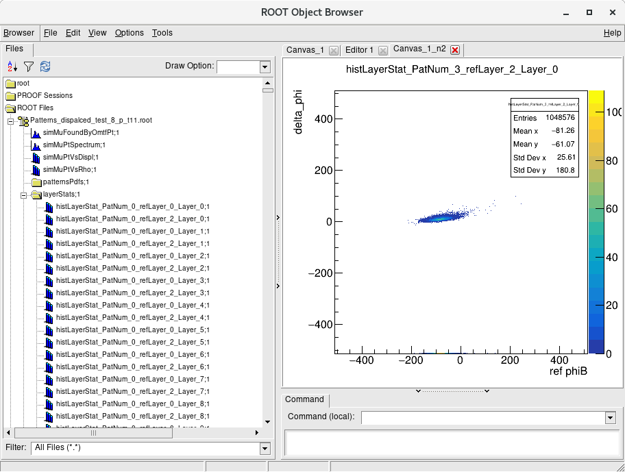

### Pattern generation 
**Before runnig the job, change the StatArrayType int the GoldenPatternWithStat.h to:**

```
typedef boost::multi_array<int, 4> StatArrayType;
```

**Set the desired options in the runMuonOverlapPatternGenerator.py:**

* output file name, e.g.:

```
process.simOmtfDigis.optimisedPatsXmlFile = cms.string("Patterns_layerStat_ExtraplMB1nadMB2_t10.xml")
```

* emulator config: lines 194-249.

##### Pattern generation for prompt muons only
```
process.simOmtfDigis.usePhiBExtrapolationFromMB1 = cms.bool(False)
process.simOmtfDigis.usePhiBExtrapolationFromMB2 = cms.bool(False)
```

##### Pattern generation with phi_B extraploation - for displaced muons
```
process.simOmtfDigis.dtRefHitMinQuality =  cms.int32(4)

process.simOmtfDigis.usePhiBExtrapolationFromMB1 = cms.bool(True)
process.simOmtfDigis.usePhiBExtrapolationFromMB2 = cms.bool(True)
```

The patterns generated with the above options set to True will work also for the prompt muons, provided in the python of the emulator job the same options are used.

##### Runing the job collecting the hits statistics:
```
cmsRun runMuonOverlapPatternGenerator.py allPt
```
it will use these samples:
/eos/user/k/kbunkow/cms_data/SingleMuFullEta/721_FullEta_v4/'

It will take ~a night to run this job with the number of files as set now in the lines 89-100

##### Runing the job generating the final patterns:

The options of the final patterns are set in the PatternGenerator.cc, in the method:

```
PatternGenerator::endJob()
(...)
else if (edmCfg.getParameter<string>("patternGenerator") == "patternGenFromStat")
...
```

and in the methods:

```
PatternGenerator::modifyClassProb()
PatternGenerator::reCalibratePt()
```

Edit them if needed.


In the runMuonOverlapPatternGeneratorClassProb.py:

* Set the input file name, e.g.:

```
process.simOmtfDigis.patternsROOTFile = cms.FileInPath("L1Trigger/L1TMuonOverlapPhase1/test/expert/omtf/Patterns_layerStat_ExtraplMB1nadMB2_t10.root")
```
* Set the output files name

```
process.simOmtfDigis.optimisedPatsXmlFile = cms.string("Patterns_ExtraplMB1nadMB2_t10_classProb17_recalib2.xml")
```
The root file with the patterns will have a similar name.

##### Running the job
```
cmsRun runMuonOverlapPatternGeneratorClassProb.py 
```
This job should run in a couple of minutes.

### Generating 2D histograms ref_phiB vs delta_phi
These histograms are useful for visualizing the distributions of the hits, they are not needed for the patterns generation itself.

**Before running the job, change the StatArrayType int the GoldenPatternWithStat.h to:**

```
typedef boost::multi_array<unsigned short, 4> StatArrayType;
```
to reduce the amount of computer memory the job needs.

In the runMuonOverlapPatternGenerator_displ.py set:

```
process.simOmtfDigis.patternGenerator = cms.string("2DHists")
```

##### Runing the job:

```
cmsRun runMuonOverlapPatternGenerator_displ.py 8_p
```

possible options:
* displHighPt - will use Carlos sample of displaced muons - see runMuonOverlapPatternGenerator_displ.py from line 92
* allPt - will use Artur sample of prompt muons - see runMuonOverlapPatternGenerator_displ.py from line 112
* 8_p - will use Artur sample of prompt muons, only the selected ptCodes - positive charge 8, 18 and 28 in this example (the ptCodes used in the file names are the in the legacy PAC scale)  - see runMuonOverlapPatternGenerator_displ.py from line 145

It will produce a file Patterns_dispalced_test_*.root, with the following plots:



One can overlay the histograms using this script - edit it as needed:
/home/kbunkow/CMSSW/CMSSW_12_1_0_pre3/src/usercode/L1MuonAnalyzer/test/drawPhiBVsDeltaPhi.py
